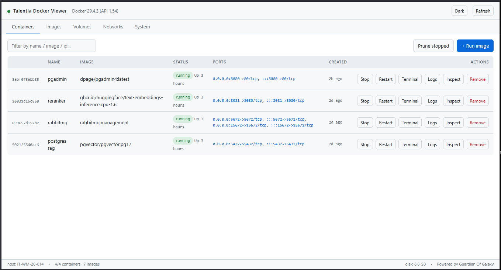
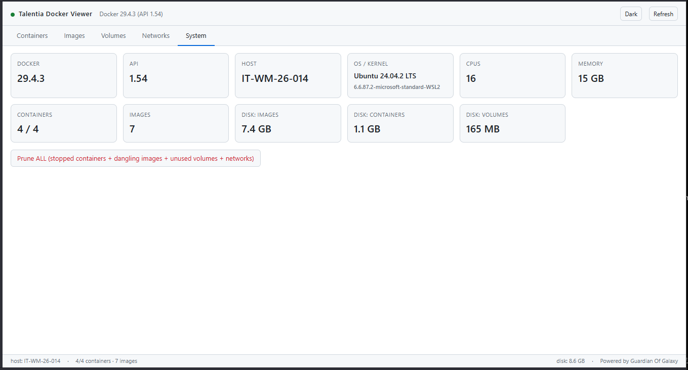

<!-- markdownlint-disable MD031 MD032 MD033 MD040 MD041 MD060 -->
<div align="center">


# Talentia Docker Viewer

**A lightweight, single-file alternative to Docker Desktop for WSL2.**
Complete web UI for managing containers, images, volumes and networks — zero external dependencies, ~1300 lines of pure Python.

[](https://www.python.org/)
[](LICENSE)

[](#-installation)

</div>

---

<div align="center">



*Manage every aspect of your Docker daemon from a clean, fast web UI — no Electron, no daemon, no bullshit.*

</div>

---

## ✨ Why Talentia Docker Viewer?

- 🪶 **Single file, ~1300 lines** — `taldocker.py`, easy to read, audit, and hack
- 🚫 **Zero external dependencies** — Python 3.8+ stdlib only
- ⚡ **Instant startup** — no Electron, no JS bundler, no daemon
- 🌐 **Browser-based** — runs on Windows, talks to Docker inside WSL2
- 🔒 **Loopback-only by default** — safe out of the box
- 🛠 **Full feature parity** with the essentials of Docker Desktop

```
[ Browser on Windows ] ──http──► [ taldocker.py in WSL ] ──unix socket──► /var/run/docker.sock
```

---

## 📦 Installation

### Option 1 — npm (recommended)

```bash
npm install -g talentia-docker-viewer
taldocker
```

> The npm package is a thin wrapper that launches the bundled Python script. Python 3.8+ must still be installed inside WSL (it almost always already is).

### Option 2 — Run directly from source

```bash
git clone https://github.com/Talentia-Software/talentia-docker-viewer.git
cd talentia-docker-viewer
python3 taldocker.py
```

Then open from any browser: **<http://localhost:8765>** (auto-opens by default).

> WSL2 automatically forwards `localhost` from Windows to the WSL kernel — no extra configuration required.

---

## 🔁 Lifecycle

By **default `taldocker` runs detached** (in background) and survives closing the terminal — the prompt returns immediately and the server keeps running.

```bash
taldocker            # start detached (default), auto-opens browser
taldocker -f         # run in foreground (logs to terminal, Ctrl+C to stop)
taldocker stop       # stop the detached instance (SIGTERM, then SIGKILL after 5s)
taldocker status     # is it running? prints PID and log path
taldocker restart    # stop + start
```

Logs go to `/tmp/taldocker.log` (override with `TALDOCKER_LOG_FILE`).
PID file at `/tmp/taldocker.pid` (override with `TALDOCKER_PID_FILE`).

> **⚠️ WSL2 caveat:** WSL2 shuts down the entire VM ~8s after the last user process exits and no terminals are open (see `vmIdleTimeout` in `wsl.conf`). A detached `taldocker` survives **closing the terminal** but **not closing WSL itself**. For a truly always-on setup, schedule `wsl.exe -d <distro> -- taldocker` at Windows boot via Task Scheduler.

---

## 🎯 Features

| Tab | Operations |
|-----|------------|
| 🐳 **Containers** | List, start, stop, restart, kill, pause/unpause, streaming logs, interactive terminal (`exec`), inspect, remove, prune |
| 📀 **Images** | List, pull with live progress bar, run with full form (ports, env, volumes, network, restart policy, entrypoint, workdir, auto-remove), inspect, remove, prune |
| 💾 **Volumes** | List, create, inspect, delete, prune |
| 🌐 **Networks** | List, create, inspect, delete, prune |
| 🖥 **System** | Docker version, host info, disk usage by category, global prune |

Tables auto-refresh every ~2.5s. Light & dark theme included.

---

## 📊 System Dashboard

<div align="center">



*At-a-glance view of your Docker host: version, kernel, CPU/RAM, disk usage by category.*

</div>

---

## ⚙️ Configuration

All options are environment variables — no config file needed.

| Variable | Default | Description |
|----------|---------|-------------|
| `TALDOCKER_PORT` | `8765` | HTTP server port |
| `TALDOCKER_HOST` | `127.0.0.1` | Bind address (keep loopback — see [Security](#-security)) |
| `DOCKER_SOCKET` | `/var/run/docker.sock` | Docker socket path |
| `TALDOCKER_NO_BROWSER` | *(unset)* | Set to `1` to skip auto-opening the browser at startup |
| `TALDOCKER_PID_FILE` | `/tmp/taldocker.pid` | Where the detached instance writes its PID |
| `TALDOCKER_LOG_FILE` | `/tmp/taldocker.log` | Where the detached instance writes stdout/stderr |

Example:
```bash
TALDOCKER_PORT=9000 taldocker
TALDOCKER_NO_BROWSER=1 taldocker   # headless mode
```

---

## 🏗 Architecture

Everything lives in [`taldocker.py`](taldocker.py):

1. **`DockerClient`** — hand-written HTTP/1.1 client over Unix socket (`AF_UNIX`). Handles standard request/response, chunked transfer-encoding for streaming (logs, pull progress) and connection hijacking for `exec`.
2. **Minimal WebSocket server (RFC 6455)** — handshake + frame encoder/decoder using only stdlib. Used only for the `exec` terminal (bidirectional).
3. **SSE (Server-Sent Events)** — used for logs and pull progress (unidirectional, simpler than WS).
4. **`AppHandler`** — REST/SSE/WS router on top of `ThreadingHTTPServer`.
5. **Embedded frontend** — single HTML/CSS/vanilla-JS page bundled inside `taldocker.py` as a string. Xterm.js loaded from CDN for the terminal.

No framework. No bundler. No toolchain.

---

## ✅ Requirements

- WSL2 with a Linux distro (Ubuntu / Debian / etc.)
- Docker Engine installed inside WSL (`docker-ce`, **not** Docker Desktop)
- Python 3.8+ (preinstalled on almost every distro)
- User in the `docker` group (see [Troubleshooting](#-troubleshooting) if you get "Permission denied")

---

## 🔒 Security

The server **listens only on `127.0.0.1`**. Do not change it to `0.0.0.0` unless you know what you are doing: the Docker socket is **root-equivalent** — anyone who can talk to Talentia Docker Viewer can launch privileged containers, mount the host filesystem, read secrets, etc.

There is no authentication: the loopback binding **is** the defense.

---

## 🛠 Troubleshooting

<details>
<summary><b>"Permission denied" on <code>/var/run/docker.sock</code></b></summary>

```bash
sudo usermod -aG docker $USER
newgrp docker
```
Then restart the WSL terminal.
</details>

<details>
<summary><b>"Cannot connect to Docker"</b></summary>

Check that the daemon is running:
```bash
sudo service docker status
sudo service docker start
```
</details>

<details>
<summary><b>Port already in use</b></summary>

Use `TALDOCKER_PORT=NNNN taldocker` with a free port. Check what is listening with `ss -tln`.
</details>

<details>
<summary><b>The terminal (exec) does not connect</b></summary>

- Make sure the container has `/bin/sh` (most images do; for `scratch`/`distroless` they don't — change the command to something that exists inside the container).
- The browser must be able to reach `cdn.jsdelivr.net` to download xterm.js the first time. After that, it is cached.
</details>

<details>
<summary><b>Empty logs</b></summary>

Some containers write only to files instead of stdout/stderr. Only Docker's streams reach here — it's a Docker limitation, not a Talentia Docker Viewer one.
</details>

---

## 🗺 Roadmap

Not included (yet):

- [ ] Building images from a `Dockerfile` (requires tar context handling)
- [ ] Compose / multi-container orchestration
- [ ] Real-time CPU/RAM stats per container
- [ ] Multi-host / Docker contexts
- [ ] User authentication (for non-loopback deployments)

---

## 📄 License

Released under the [MIT License](LICENSE). No warranty.

---

<div align="center">

**Powered by Guardian Of Galaxy** 🚀

<sub>Built with ❤️ at <a href="https://www.talentia-software.com">Talentia Software</a></sub>

</div>
